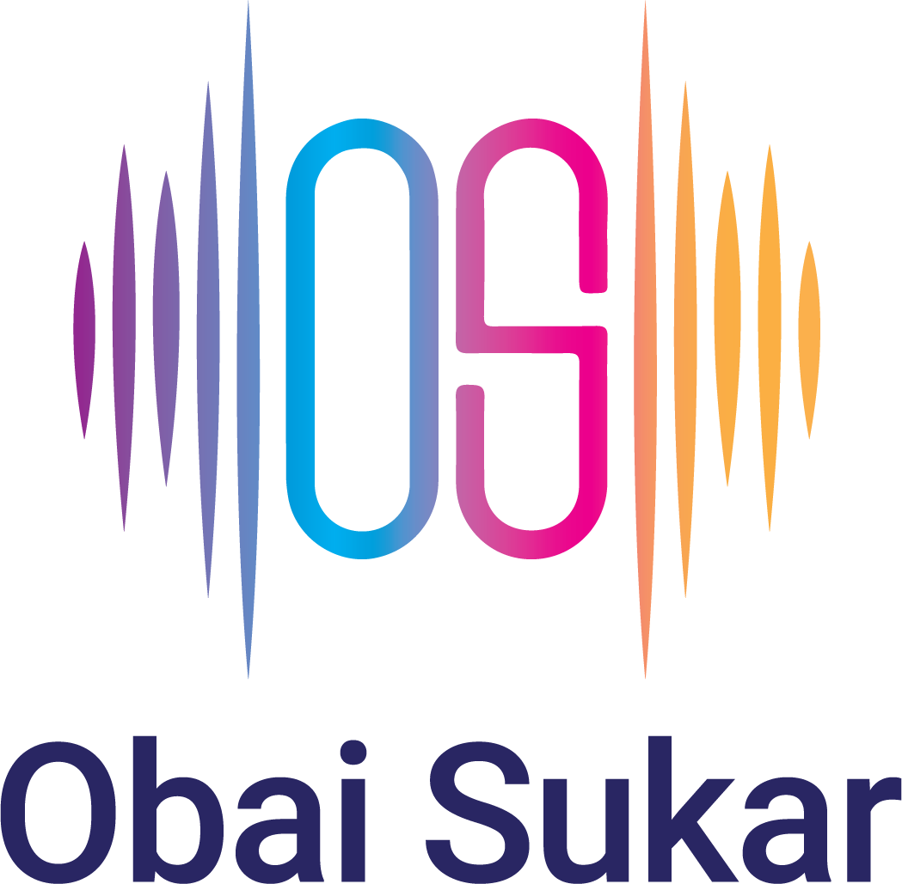

# Professional Report Formatting Standards
## Obai Sukar - Audio Engineering Reports & Proposals

This document defines the formatting standards used in the Umayyad Mosque Sound System Report, to be used as a template for all future technical reports and proposals.

---

## 1. Document Structure

### Page Setup (CSS @page)
```css
@page {
    size: letter;
    margin: 0.75in;
}

@page :first {
    margin: 0;
}

@page landscape {
    size: letter landscape;
    margin: 0.5in;
}
```
- **Paper size**: US Letter (8.5" × 11")
- **Margins**: 0.75in all sides (standard margins)
- **First page**: No margins (for cover page)
- **Landscape pages**: Available for wide content (e.g., floorplans, diagrams)
- **Print-friendly**: Optimized for both screen viewing and PDF export

### Body Typography
```css
body {
    font-family: 'Segoe UI', Tahoma, Geneva, Verdana, sans-serif;
    font-size: 11pt;
    line-height: 1.6;
    color: #2c3e50;
    background: white;
    margin: 0;
    padding: 0;
}

.page-container {
    max-width: 8.5in;
    margin: 0 auto;
    background: white;
    padding: 0.75in;
}

.landscape-page {
    page: landscape;
    max-width: 11in;
    padding: 0.5in;
}
```
- **Font**: Segoe UI (professional, highly readable)
- **Base size**: 11pt (optimal for technical documents)
- **Line height**: 1.6 (prevents cramped text, aids readability)
- **Text color**: #2c3e50 (dark blue-gray, easier on eyes than pure black)

---

## 2. Color Palette

### Primary Colors
```css
/* Headers and Section Numbers */
h1, h2, h3 { color: #2c3e50; }  /* Dark blue-gray */

/* Accent Color (links, emphasis) */
.accent { color: #3498db; }      /* Professional blue */

/* Table Headers */
thead { background: #3498db; }   /* Professional blue */
```

### Semantic Colors (Graphs & Highlights)
```css
/* Status/System Colors */
--degraded-red: #E74C3C;         /* Existing degraded equipment */
--reference-blue: #3498db;       /* Reference measurements */
--proposed-green: #27AE60;       /* Proposed system */
--exterior-cyan: #1ABC9C;        /* Exterior zones */
--warning-orange: #F39C12;       /* Caution items */

/* Highlight Boxes */
--highlight-bg: #E8F8F5;         /* Light turquoise background */
--highlight-border: #1ABC9C;     /* Turquoise border */
--warning-bg: #FADBD8;           /* Light red background */
--warning-border: #E74C3C;       /* Red border */
```

### Color Usage Guidelines
- **RED**: Degraded equipment, critical warnings, problems
- **BLUE**: Reference data, professional headings, links
- **GREEN**: Proposed solutions, positive results
- **CYAN**: Exterior/courtyard zones
- **ORANGE**: Cautions, moderate concerns

---

## 3. Typography Hierarchy

### Heading Sizes
```css
h1 {
    font-size: 24pt;
    color: #2c3e50;
    margin-top: 8mm;
    margin-bottom: 4mm;
    border-bottom: 2px solid #3498db;
    padding-bottom: 3mm;
    page-break-after: avoid;
}

h2 {
    font-size: 18pt;
    color: #2c3e50;
    margin-top: 6mm;
    margin-bottom: 3mm;
    border-bottom: 1px solid #bdc3c7;
    padding-bottom: 2mm;
    page-break-after: avoid;
}

h3 {
    font-size: 14pt;
    color: #2c3e50;
    margin-top: 5mm;
    margin-bottom: 2mm;
    page-break-after: avoid;
}

h4 {
    font-size: 12pt;
    color: #34495e;
    margin-top: 3mm;
    margin-bottom: 1.5mm;
    font-weight: 600;
    page-break-after: avoid;
}
```

### Typography Guidelines
- **H1**: Major sections only (Section 1, Section 2, etc.)
- **H2**: Subsections within major sections
- **H3**: Sub-subsections and detailed breakdowns
- **H4**: Minor headings within detailed sections
- **Border underlines**: H1 uses blue, H2 uses gray (visual hierarchy)
- **Page breaks**: Headings avoid breaking at bottom of page

---

## 4. Tables

### Standard Table Styling
```css
table {
    width: 100%;
    border-collapse: collapse;
    margin: 3mm 0;
    font-size: 10pt;
    page-break-inside: avoid;
}

thead {
    background: #3498db;
    color: white;
    font-weight: bold;
}

thead th {
    padding: 2mm 3mm;
    text-align: left;
    border: 1px solid #2980b9;
}

tbody td {
    padding: 2mm 3mm;
    border: 1px solid #ddd;
}

tbody tr:nth-child(even) {
    background: #f8f9fa;  /* Zebra striping */
}

tbody tr:hover {
    background: #e8f4f8;  /* Hover highlight */
}
```

### Table Design Principles
- **Full width**: Tables span 100% of content area
- **Zebra striping**: Alternating row colors improve readability
- **Professional blue header**: Matches document accent color
- **Hover effects**: Interactive highlighting (screen viewing)
- **Page break protection**: Tables avoid breaking mid-row
- **Smaller font**: 10pt (vs body 11pt) fits more data

---

## 5. Images and Figures

### Single-Column Layout (DEFAULT)
```css
.image-grid {
    display: grid;
    grid-template-columns: 1fr;  /* Single column - all images stacked */
    gap: 5mm;
    margin: 5mm 0;
}

.image-grid img {
    width: 100%;
}
```

### Figure Captions
```css
figcaption, .caption {
    font-size: 9pt;
    color: #666;
    margin-top: 2mm;
    margin-bottom: 5mm;
    font-style: italic;
    text-align: center;
}
```

### Image Guidelines
- **Always single column**: Images stack vertically for better print quality
- **Full width**: Images expand to 100% of available width
- **Captions below**: Always include descriptive captions
- **Alt text**: Every image must have meaningful alt text

---

## 6. SVG Graphs

### Graph Dimensions
```svg
<svg width="800" height="500" xmlns="http://www.w3.org/2000/svg">
```
- **Aspect ratio**: 800×500 (16:10, optimal for frequency response graphs)
- **Embedded**: SVGs embedded directly in HTML (no external files)
- **Vector format**: Infinitely scalable, perfect print quality

### Frequency Response Graph Structure
```svg
<!-- Background -->
<rect width="800" height="500" fill="white"/>

<!-- Plot area (with margin for axes) -->
<rect x="50" y="50" width="700" height="400" fill="white" stroke="#333" stroke-width="1"/>

<!-- Grid lines -->
<line x1="50" y1="450" x2="750" y2="450" stroke="#E0E0E0" stroke-width="0.5" opacity="0.3"/>
<!-- (Horizontal lines for dB values) -->

<line x1="50" y1="50" x2="50" y2="450" stroke="#E0E0E0" stroke-width="0.5" opacity="0.3"/>
<!-- (Vertical lines for frequency values) -->

<!-- Y-axis labels (dB) -->
<text x="40" y="454" text-anchor="end" font-family="Arial, sans-serif" font-size="12" fill="#333">-20</text>
<!-- (Labels: -20, -15, -10, -5, 0, +5 dB) -->

<!-- X-axis labels (Frequency - logarithmic) -->
<text x="50" y="470" text-anchor="middle" font-family="Arial, sans-serif" font-size="11" fill="#333">20</text>
<!-- (Labels: 20, 31.5, 63, 125, 250, 500, 1k, 2k, 4k, 8k, 16k Hz) -->

<!-- Frequency response curve -->
<path d="M 50,400 L 80,380 L 100,350..."
      stroke="#E74C3C" stroke-width="3" fill="none"/>

<!-- Data point markers -->
<circle cx="50" cy="400" r="3" fill="#E74C3C"/>

<!-- Title -->
<text x="400" y="30" text-anchor="middle" font-size="18" font-weight="bold">
    Right Back (Dynacord) - Aged Speaker Response
</text>

<!-- Legend (if multiple curves) -->
<rect x="600" y="60" width="15" height="15" fill="#E74C3C"/>
<text x="620" y="72" font-family="Arial, sans-serif" font-size="12" fill="#333">
    Existing System
</text>
</svg>
```

### Graph Guidelines
- **Logarithmic X-axis**: Frequency from 20 Hz to 16 kHz (logarithmic scale)
- **Linear Y-axis**: Gain from -20 dB to +5 dB (linear scale)
- **Color-coded curves**:
  - RED (#E74C3C): Degraded equipment
  - BLUE (#3498db): Reference measurements
  - GREEN (#27AE60): Proposed system
  - CYAN (#1ABC9C): Exterior zones
- **Grid opacity**: 30% (visible but not distracting)
- **Curve thickness**: 3px stroke width
- **Data markers**: 3px radius circles at each measurement point

---

## 7. Highlight Boxes

### Information Highlight
```css
.highlight {
    background: #E8F8F5;
    border-left: 5px solid #1ABC9C;
    padding: 3mm 5mm;
    margin: 5mm 0;
    page-break-inside: avoid;
}
```
**Usage**: Important information, key findings, recommendations

### Warning/Critical Box
```css
.highlight.warning {
    background: #FADBD8;
    border-left: 5px solid #E74C3C;
    padding: 20px;
    margin: 25px 0;
}

.highlight.warning h3 {
    color: #C0392B;
    margin-top: 0;
}
```
**Usage**: Critical warnings, preliminary data disclaimers, blockers

### Example
```html
<div class="highlight warning">
    <h3>⚠️ IMPORTANT: Preliminary Data</h3>
    <p><strong>This measurement requires validation.</strong></p>
    <ul>
        <li>Methodology unverified</li>
        <li>Limited measurement positions</li>
    </ul>
</div>
```

---

## 8. Lists

### Unordered Lists
```css
ul {
    margin: 2mm 0;
    padding-left: 8mm;
}

li {
    margin-bottom: 1.5mm;
}
```

### Nested Lists
```css
ul ul {
    margin-top: 1mm;
    padding-left: 6mm;
}
```

### List Guidelines
- **Bullet points**: Use for non-sequential items
- **Bold lead-ins**: **Term**: Description format for definition lists
- **Spacing**: 1.5mm between items (readable but compact)
- **Indentation**: 8mm from left margin

---

## 9. Cover Page

### Cover Page Structure
```html
<div class="cover-page" style="text-align: center; padding: 50mm 20mm;">
    <!-- Logo -->
    

    <!-- Title -->
    <h1 style="font-size: 36pt; color: #2c3e50; margin: 40px 0;">
        Comprehensive Umayyad Mosque<br>
        Sound System Assessment &<br>
        Redesign Proposal
    </h1>

    <!-- Subtitle -->
    <h2 style="font-size: 20pt; color: #3498db; margin: 30px 0;">
        UNESCO World Heritage Site - Damascus, Syria
    </h2>

    <!-- Author -->
    <div style="font-size: 24pt; color: #3498db; font-weight: bold; margin: 40px 0;">
        Presented by Obai Sukar
    </div>

    <!-- Contact -->
    <div style="font-size: 16pt; color: #555; margin: 20px 0;">
        obaisukar.com<br>
        Audio Engineering & Sound System Design
    </div>

    <!-- Date (optional - can omit for flexible timeline) -->
    <div style="font-size: 12pt; color: #777; margin: 40px 0;">
        Assessment Period: 2025
    </div>
</div>

<div class="page-break"></div>
```

### Cover Page Guidelines
- **Logo**: Centered, max 300px width
- **Title**: 36pt, dark color, multi-line OK
- **Subtitle**: 20pt, accent blue color
- **Author**: 24pt, bold, accent blue
- **Contact**: Website and specialization
- **Dates**: Optional (omit for flexible timelines)
- **Page break**: Always after cover

---

## 10. Table of Contents

### TOC Styling
```css
.toc {
    margin: 10mm 0;
    padding: 0;
    list-style: none;
}

.toc li {
    padding: 2mm 0;
    border-bottom: 1px solid #ecf0f1;
}

.toc a {
    text-decoration: none;
    color: #2c3e50;
    display: block;
}

.toc a:hover {
    color: #3498db;
    background: #f8f9fa;
}

.toc .section-number {
    display: inline-block;
    width: 10mm;
    font-weight: bold;
    color: #3498db;
}
```

### TOC Structure
```html
<h1>Table of Contents</h1>
<ul class="toc">
    <li><a href="#section1"><span class="section-number">1.</span> Executive Summary</a></li>
    <li><a href="#section2"><span class="section-number">2.</span> Current System Assessment</a></li>
    <!-- etc. -->
</ul>
```

---

## 11. Page Break Management

### Page Break Classes
```css
.page-break {
    page-break-after: always;
}

h1, h2, h3, h4 {
    page-break-after: avoid;  /* Don't orphan headings */
}

table, figure, .highlight {
    page-break-inside: avoid;  /* Keep tables/figures together */
}
```

### Page Break Usage
- **After cover**: Always
- **After TOC**: Always
- **Between major sections**: As needed (not automatic)
- **Never**: After headings, within tables, within highlight boxes

---

## 11.5. Landscape Pages

### Using Landscape Orientation

For wide content like floorplans, network diagrams, or wide tables, wrap the content in a `.landscape-page` div:

```html
<div class="page-break"></div>

<div class="landscape-page">
    <h1>4. Floor Plan Analysis & Current Speaker Placement</h1>

    <h2>4.1 Floor Plan Overview</h2>

    <p>Content description...</p>

    

    <!-- More landscape content -->
</div>

<div class="page-break"></div>
```

### Landscape Page Guidelines
- **Use sparingly**: Only for genuinely wide content that doesn't fit portrait
- **Full section**: Wrap entire logical section (heading to content) in landscape-page div
- **Page breaks**: Always add page break before and after landscape section
- **Image sizing**: Use `max-width: 100%; height: auto;` for responsive scaling
- **Common uses**: Floorplans, site maps, network diagrams, wide Gantt charts, system architecture diagrams

### CSS for Landscape
```css
@page landscape {
    size: letter landscape;
    margin: 0.5in;
}

.landscape-page {
    page: landscape;
    max-width: 11in;  /* Letter height becomes width in landscape */
    padding: 0.5in;
}
```

---

## 12. Print-Specific CSS

### Print Media Query
```css
@media print {
    body {
        background: white;
        margin: 0;
        padding: 0;
    }

    .page-container {
        padding: 0;
        box-shadow: none;
        max-width: 100%;
        margin: 0;
    }

    .landscape-page {
        padding: 0.5in;
    }

    a {
        color: #000;
        text-decoration: none;
    }

    .page-break {
        page-break-after: always;
    }

    /* Prevent page breaks in these elements */
    h1, h2, h3, h4, h5, h6 {
        page-break-after: avoid;
        page-break-inside: avoid;
    }

    table, figure, img, svg {
        page-break-inside: avoid;
    }

    .highlight, .warning, .success, .info, .equipment-spec {
        page-break-inside: avoid;
    }

    /* Better orphan/widow control */
    p, li {
        orphans: 3;
        widows: 3;
    }

    /* Reduce margins slightly for print */
    h1 {
        margin-top: 6mm;
        margin-bottom: 3mm;
    }

    h2 {
        margin-top: 5mm;
        margin-bottom: 2mm;
    }

    h3 {
        margin-top: 4mm;
        margin-bottom: 2mm;
    }

    /* Scale SVG graphs for print */
    svg {
        max-width: 7in;
        height: auto;
    }

    .no-print {
        display: none;  /* Hide web-only elements */
    }
}
```

### Print Optimization Guidelines
- **Remove margins**: Page container should have no padding in print mode
- **Prevent breaks**: Keep headings, tables, images, and highlight boxes together
- **Orphan/widow control**: Minimum 3 lines at top/bottom of pages
- **Scale SVGs**: Limit to 7in width for letter-size pages
- **Remove colors from links**: Black text for print
- **Reduce heading margins**: Tighter spacing for print efficiency

---

## 13. Code Standards

### HTML Structure
```html
<!DOCTYPE html>
<html lang="en">
<head>
    <meta charset="UTF-8">
    <meta name="viewport" content="width=device-width, initial-scale=1.0">
    <title>Project Name - Report Type</title>
    <style>
        /* All CSS embedded in <style> tag */
    </style>
</head>
<body>
    <!-- Content here -->
</body>
</html>
```

### Best Practices
- **Single file**: Everything in one HTML file (CSS embedded, SVGs inline)
- **Semantic HTML**: Use proper heading hierarchy (h1→h2→h3)
- **IDs for anchors**: Every major section has id="section1", id="section2", etc.
- **Alt text**: Every image has descriptive alt text
- **Descriptive titles**: Graph titles describe the data shown
- **Comments**: Use HTML comments to mark section boundaries

---

## 14. PDF Export Settings

### Chrome Headless Command
```bash
/Applications/Google\ Chrome.app/Contents/MacOS/Google\ Chrome \
  --headless \
  --disable-gpu \
  --print-to-pdf="/path/to/output.pdf" \
  --print-to-pdf-no-header \
  --no-pdf-header-footer \
  /path/to/input.html
```

### PDF Guidelines
- **No headers/footers**: Clean professional appearance
- **A4 size**: Matches CSS @page settings
- **Embedded fonts**: System fonts render correctly
- **Vector graphics**: SVGs maintain perfect quality
- **Hyperlinks**: TOC links remain functional in PDF

---

## 15. File Naming Convention

### Report Files
```
Project_Name_Report_Type_Report.html
Project_Name_Report_Type_Report.pdf
```

**Examples:**
- `Umayyad_Mosque_COMPLETE_FINAL_Report.html`
- `Umayyad_Mosque_COMPLETE_FINAL_Report.pdf`

### Supporting Files
```
PROJECT_REFERENCE_AND_REQUIREMENTS.md
ACOUSTIC_SIMULATION_SPECIFICATION.md
REPORT_FORMATTING_STANDARDS.md
FINAL_PROJECT_SUMMARY.md
```

### Image Files
```
images/
├── client_logo.png
├── image1a.jpg
├── image1b.jpg
└── ...
```

---

## 16. Quick Reference Checklist

### Before Starting a Report
- [ ] Collect client logo (PNG, max 300px width)
- [ ] Gather all technical photos
- [ ] Prepare data for graphs/tables
- [ ] Define color scheme (stick to standard palette)

### During Report Writing
- [ ] Use proper heading hierarchy (h1→h2→h3→h4)
- [ ] Add ID anchors to major sections
- [ ] Include table of contents with working links
- [ ] Use highlight boxes for important info
- [ ] Use warning boxes for critical items
- [ ] Embed SVG graphs (not external images)
- [ ] Single-column layout for all images/graphs
- [ ] Add descriptive captions to all figures
- [ ] Use zebra-striped tables
- [ ] Insert page breaks after cover and TOC

### Before Finalizing
- [ ] Check all links work
- [ ] Verify all images display correctly
- [ ] Test print preview (Ctrl+P / Cmd+P)
- [ ] Generate PDF via Chrome headless
- [ ] Verify PDF file size reasonable (<15 MB)
- [ ] Check PDF renders correctly (fonts, colors, graphics)
- [ ] Final proofread for typos/formatting

---

## 17. Template File Location

**Master template**: `/Volumes/Ai/Projects/ummayad/Umayyad_Mosque_COMPLETE_FINAL_Report.html`

**To create new report:**
1. Copy master template to new project folder
2. Replace client logo
3. Update cover page (title, client name, date)
4. Replace content sections
5. Update table of contents
6. Replace images/graphs with project-specific data
7. Generate PDF using Chrome headless

---

## Summary

This formatting standard emphasizes:
- **Professional appearance**: Clean, modern design with consistent colors
- **Readability**: Proper typography, spacing, and hierarchy
- **Print quality**: A4 page setup, page break management
- **Single-column layout**: All images and graphs stack vertically
- **Embedded graphics**: SVGs for perfect vector quality
- **Accessibility**: Semantic HTML, alt text, proper headings
- **Portability**: Single-file HTML, embeds all CSS and SVGs

**Key principle**: Every design choice serves either readability, professionalism, or print quality.
